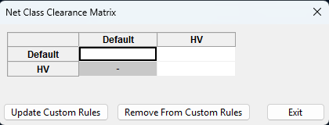

# Net Class Clearance Matrix (NCCM) KiCad Plugin

  

Net class clearance matrix plugin for KiCad! To generate custom rules for clearances between net classes through a matrix GUI.

## Installing
### Via KiCad's Plugin and Content Manager
Search 'NCCM' in KiCad's PCM and it should show up! Select 'Yes' when prompted to enable KiCad's Plugin API.

### Manual
To install place this entire folder in the platform-dependent plugins directory,

| Platform | Path
|----------|------
| Windows  | `C:\Users\<username>\Documents\KiCad\9.0\plugins`
| macOS    | `/Users/<username>/Documents/KiCad/9.0/plugins`
| Linux    | `~/.local/share/KiCad/9.0/plugins`

Then in KiCad preferences go to `Plugins`, check the `Enable KiCad API` checkbox.

Restart KiCad and it should appear in the layout editor on the top right.

## Using
On succesful installation, open KiCad and you should see the NCCM logo on the toolbar. Once clicked you should see this simple GUI populated with all your project net classes.

Enter your net class clearances and click `Update Custom Rules` to add them to the `.kicad_dru` file. Remove the custom rules by clicking `Remove From Custom Rules`.

## Development
GUI was built using wxFormBuilder. Project file for that is under `ui/`.

The `kicad-python` package was installed and used as specified in the KiCad API Python Bindings [repository](https://gitlab.com/kicad/code/kicad-python).

To debug the plugin with a KiCad instance open in your own terminal, enable the KiCad API by checking the `Enable KiCad API` checkbox. It will default to the Python interpreter shipped with KiCad but that can be changed if desired.

For live debugging a board file must be loaded to get data from. Feel free to use the test project under `tests/`.

## Known Issues
The plugin might not work if there are multiple instances of KiCad open. This is possibly a limitation of `kicad-python`.

## License
NCCM is licensed under the GNU General Public License v3.0 (GPLv3). It incorporates components that are licensed under the MIT License. These MIT-licensed modules remain under their original license terms and are compatible with the GPLv3. For full licensing details, refer to the LICENSE file and visit https://www.gnu.org/licenses/gpl-3.0.html.
